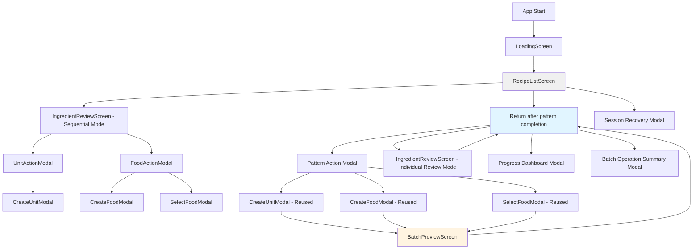
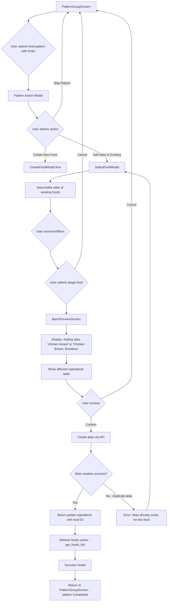
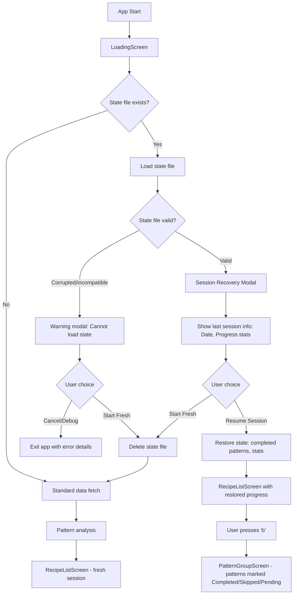
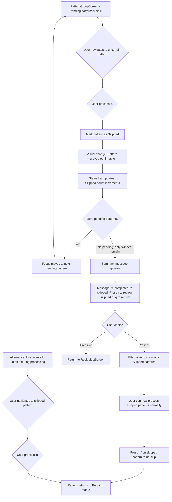

# Mealie Ingredient Parser TUI Enhancements UI/UX Specification

This document defines the user experience goals, information architecture, user flows, and visual design specifications for Mealie Ingredient Parser TUI Enhancements's user interface. It serves as the foundation for visual design and frontend development, ensuring a cohesive and user-centered experience.

## Overall UX Goals & Principles

### Target User Personas

**1. Bulk Migration User**
System administrators or power users performing one-time large-scale migrations from other recipe platforms (e.g., importing 200+ recipes from Paprika, Recipe Keeper). They need to process 500+ unparsed ingredients efficiently and expect the tool to "learn" from their decisions. Technical comfort level: High. Primary pain point: Time investment (current 4+ hour sessions).

**2. Regular Home Cook with Accumulated Backlog**
Casual Mealie users who have accumulated 50-100 unparsed ingredients over months of recipe scraping. They want to clean up their database periodically but find the sequential workflow tedious. Technical comfort level: Medium. Primary pain point: Repetitive decision-making for obvious patterns (e.g., "tsp" appearing 30 times).

**3. Recipe Collection Manager**
Organized users who maintain large recipe databases (500+ recipes) and want to keep data quality high. They prefer batch operations for consistency and appreciate detailed statistics to track progress. Technical comfort level: High. Primary pain point: Database pollution from inconsistent unit/food creation.

### Usability Goals

- **Efficiency of batch operations:** Users can process 500 ingredients in ~15 minutes (vs. 4+ hours in sequential mode)
- **Clarity of action scope:** Users clearly understand whether an action affects one ingredient or many before confirming
- **Error prevention:** Batch operations include preview-before-commit pattern to prevent accidental mass changes
- **Workflow flexibility:** Users can seamlessly switch between batch mode (for patterns) and sequential mode (for edge cases) without losing progress
- **Progress visibility:** Users always know: how many ingredients remain, what's been processed, what's been skipped, and can resume interrupted sessions

### Design Principles

1. **Teach Once, Apply Everywhere** - When users make a decision (e.g., create "tsp" unit), the system should intelligently apply it to all matching cases. Eliminate mechanical repetition.

2. **Preview Before Commit** - Every batch operation shows affected ingredients in a confirmation screen. Users should never be surprised by the scope of their actions.

3. **Keyboard-First, Always** - All workflows accessible via single-key shortcuts. Power users should never need to reach for a mouse. Sequential navigation with clear visual focus indicators.

4. **Progressive Disclosure** - Start with pattern groups (high-level view), drill down to individual ingredients only when needed. Don't overwhelm with detail until requested.

5. **Fail Gracefully, Continue Forward** - Transient API errors shouldn't halt entire batch operations. Collect failures, report clearly, allow retry of failed subset.

### Change Log

| Date       | Version | Description                                      | Author              |
|------------|---------|--------------------------------------------------|---------------------|
| 2025-10-07 | 1.0     | Initial UI/UX specification for batch processing | Sally (UX Expert)   |

---

## Information Architecture (IA)

### Site Map / Screen Inventory



**Screen Hierarchy:**
- **LoadingScreen** (Entry point) - Fetches data, analyzes patterns, checks for saved sessions
- **RecipeListScreen** (Main hub) - Lists unparsed recipes with stats; gateway to both modes
- **PatternGroupScreen** (NEW - Batch mode) - Groups ingredients by pattern with batch actions
- **BatchPreviewScreen** (NEW - Confirmation) - Shows all affected ingredients before batch commit
- **IngredientReviewScreen** (Existing - Sequential) - One-ingredient-at-a-time processing
- **Modals** - Reused across both modes for consistency (CreateUnitModal, CreateFoodModal, SelectFoodModal)

### Navigation Structure

**Primary Navigation:** Keyboard-driven screen transitions with clear mode indicators in status bar

- From **RecipeListScreen**:
  - `Enter` on recipe → **IngredientReviewScreen** (sequential mode for that recipe)
  - `b` → **PatternGroupScreen** (batch mode across all recipes)
  - `q` → Exit application

- From **PatternGroupScreen**:
  - `Enter` on pattern → **Pattern Action Modal** → (create/alias) → **BatchPreviewScreen**
  - `i` on pattern → **IngredientReviewScreen** (individual review for that pattern's instances)
  - `s` on pattern → Skip pattern (stays on PatternGroupScreen)
  - `d` → **Progress Dashboard Modal**
  - `q` → **RecipeListScreen**

- From **BatchPreviewScreen**:
  - `Enter` or `c` → Confirm and execute batch operation → **PatternGroupScreen**
  - `Esc` or `x` → Cancel and return → **PatternGroupScreen**

**Secondary Navigation:** Context-sensitive help footer on every screen showing available shortcuts

**Breadcrumb Strategy:** Status bar shows current mode and screen path:
- `Recipe List` (neutral)
- `Recipe List > Batch Mode` (when in PatternGroupScreen)
- `Recipe List > Batch Mode > Preview` (when confirming batch operation)
- `Recipe List > Sequential: [Recipe Name]` (when processing individual recipe)

---

## User Flows

### Flow 1: Batch Unit Creation

**User Goal:** Create a unit once (e.g., "tsp") and apply it to all matching unparsed ingredients across multiple recipes

**Entry Points:**
- RecipeListScreen → Press `b` → PatternGroupScreen with unit patterns displayed
- Resume session → Directly to PatternGroupScreen if saved state exists

**Success Criteria:**
- Unit created in Mealie database
- All ingredients with matching pattern updated with new unit ID
- Pattern marked as "Completed" in PatternGroupScreen
- Success message shows count of affected ingredients

#### Flow Diagram

```mermaid
graph TD
    A[PatternGroupScreen] --> B{User selects unit pattern with Enter}
    B --> C[Pattern Action Modal appears]
    C --> D{User selects action}
    D -->|Create New Unit| E[CreateUnitModal]
    D -->|Skip Pattern| A
    E --> F{User fills form: abbreviation, name, description}
    F -->|Submit| G[Validate unit data]
    G -->|Invalid| H[Show error message]
    H --> E
    G -->|Valid| I[BatchPreviewScreen]
    I --> J[Display table: Recipe | Ingredient Text | Status]
    J --> K{User reviews and chooses}
    K -->|Confirm - Enter/c| L[Create unit via API]
    L --> M[Progress indicator: Updating ingredients...]
    M --> N[Batch update all ingredients with unit ID]
    N --> O{Any failures?}
    O -->|No failures| P[Success modal: X ingredients updated]
    O -->|Some failures| Q[Partial success modal: X/Y updated, Z failed]
    Q --> R[Show failure details + Retry option]
    P --> S[Return to PatternGroupScreen - pattern marked Completed]
    S --> A
    K -->|Cancel - Esc/x| A
    F -->|Cancel| A
```

#### Edge Cases & Error Handling

- **Duplicate unit abbreviation:** Pre-flight validation catches before API call; modal shows error "Unit 'tsp' already exists"
- **API timeout during creation:** Retry with exponential backoff (3 attempts); if all fail, show error and don't proceed to batch update
- **Partial batch update failures:** Continue processing remaining ingredients; show summary with failed items and "Retry Failed" button
- **Network disconnect mid-batch:** Collect all failures, display error modal with list of affected recipe names, mark pattern as "Pending" (not completed)
- **Empty pattern list:** Shouldn't occur (pattern analysis filters these), but if encountered, show warning "No ingredients found for pattern" and skip

**Notes:** CreateUnitModal is reused from existing sequential workflow. BatchPreviewScreen must clearly indicate this is a CREATE operation (not alias). Progress indicator during batch update is critical - users need to know system is working (could take 10-30 seconds for 50+ ingredients).

---

### Flow 2: Batch Food Alias Creation

**User Goal:** Add an alias to an existing food (e.g., alias "chicken breast" → existing food "Chicken Breast, Boneless") and apply to all matching ingredients

**Entry Points:**
- RecipeListScreen → Press `b` → PatternGroupScreen with food patterns displayed
- PatternGroupScreen after skipping unit patterns

**Success Criteria:**
- Alias created for existing food in Mealie database
- All ingredients with matching pattern updated with food ID
- Pattern marked as "Completed"
- Foods cache refreshed before processing next pattern

#### Flow Diagram



#### Edge Cases & Error Handling

- **Alias already exists for selected food:** API returns 409 conflict; show error modal "Alias 'chicken breast' already exists for 'Chicken Breast, Boneless'" and return to SelectFoodModal
- **Food deleted between cache load and alias creation:** API returns 404; show error "Selected food no longer exists" and refresh foods cache, return to SelectFoodModal
- **Search returns no results in SelectFoodModal:** Show "No foods found matching '[query]'" message; offer "Create New Food Instead" option
- **User selects wrong food accidentally:** BatchPreviewScreen shows food name clearly in header; user can cancel and re-select
- **Cache refresh fails after alias creation:** Log warning but continue; alias was created successfully, next pattern will trigger cache refresh attempt

**Notes:** SelectFoodModal must support fuzzy search (users typing "chicken" should see "Chicken Breast, Boneless", "Chicken Thigh", etc.). BatchPreviewScreen header MUST clearly show the target food name to prevent mistakes. Cache refresh after alias creation is critical - if skipped, the new alias won't be available for similarity detection on subsequent patterns.

---

### Flow 3: Session Recovery After Interruption

**User Goal:** Resume batch processing work after closing the application, without losing progress or repeating completed patterns

**Entry Points:**
- App startup → LoadingScreen detects `.mealie_parser_state.json` file

**Success Criteria:**
- User presented with clear choice: resume or start fresh
- If resume selected, PatternGroupScreen shows accurate completed/skipped/pending status
- Completed patterns do not reappear
- Progress statistics (units/foods created, ingredients processed) reflect previous session

#### Flow Diagram



#### Edge Cases & Error Handling

- **State file from older app version (schema mismatch):** Detect version incompatibility; show error "State file from incompatible version, starting fresh" and delete file
- **State file references deleted recipes:** During load, validate recipe IDs still exist; silently remove non-existent recipes from state, continue with valid data
- **Corrupted JSON in state file:** Catch parse exception; show user-friendly error "Cannot read saved session (file corrupted)" with Start Fresh option
- **State file timestamp very old (30+ days):** Show warning in recovery modal "This session is from [date] - Mealie data may have changed. Recommend starting fresh." but still allow resume
- **User creates unit/food outside app, then resumes:** Pattern might be resolved now; re-run pattern analysis on resume to detect this, skip patterns that are now fully parsed

**Notes:** Recovery modal should show meaningful stats (e.g., "Last session: Oct 5, 2025 - 47 patterns completed, 120 ingredients processed") to help user decide. If state restoration encounters any errors during the process, should fall back to fresh session rather than leaving app in inconsistent state.

---

### Flow 4: Pattern Skip and Defer

**User Goal:** Skip uncertain patterns without making a decision, focus on high-confidence patterns first, review skipped patterns later

**Entry Points:**
- PatternGroupScreen with pending patterns

**Success Criteria:**
- Pattern marked as "Skipped" and visually distinguished (grayed out)
- Skipped pattern remains in list for later review
- User can un-skip patterns
- After all pending patterns processed, user prompted to review skipped patterns

#### Flow Diagram



#### Edge Cases & Error Handling

- **User skips all patterns without processing any:** Show message "All patterns skipped. Press 'r' to review or 'q' to exit batch mode." No success stats displayed.
- **User accidentally skips pattern:** Press 'u' to immediately undo; pattern returns to Pending state and becomes selectable
- **Skipped pattern resolved externally (unit/food created outside app):** On next load or pattern refresh, pattern disappears from list entirely (no longer unparsed)
- **User processes skipped pattern later, creates unit/food:** Skipped status changes to Completed normally; no special handling needed
- **User quits app with skipped patterns, resumes session:** State file preserves skipped status; patterns appear as Skipped on resume

**Notes:** Skipped patterns should remain visible in table (not hidden) to remind user they exist. Visual distinction must be clear but not too subtle - consider strikethrough text + dimmed color + "SKIPPED" label in status column. The 'r' key to review skipped is only available after all pending patterns are done, to encourage users to handle high-confidence items first.

---

## Wireframes & Mockups

**Primary Design Files:** Terminal-based UI (TUI) using Textual framework - no traditional design tool mockups needed. ASCII-based wireframes below represent actual terminal rendering.

### Key Screen Layouts

#### PatternGroupScreen (Batch Mode)

**Purpose:** Display grouped ingredient patterns with counts, allowing users to select patterns for batch operations

**Key Elements:**
- Table with sortable columns: Pattern Text, Type (Unit/Food), Count, Status
- Visual distinction between unit patterns and food patterns (grouped sections or color coding)
- Status indicators: Pending (default), Completed (green/checkmark), Skipped (gray/strikethrough)
- Real-time statistics in header: Total Patterns, Completed, Skipped, Pending
- Context-sensitive footer showing available keyboard shortcuts
- Focus indicator on selected row (highlighted/bordered)

**Interaction Notes:**
- Arrow keys for navigation, Enter to open action modal, 's' to skip, 'u' to un-skip, 'd' for progress dashboard
- Table auto-scrolls as patterns are completed to keep pending items visible
- Completed patterns remain in table but grayed out to show progress
- Pressing 'q' returns to RecipeListScreen with all progress preserved

**ASCII Wireframe:**
```
┌─────────────────────────────────────────────────────────────────────────────┐
│ Mealie Ingredient Parser - Batch Mode                                      │
│ Total: 42 patterns | Completed: 15 | Skipped: 3 | Pending: 24             │
├─────────────────────────────────────────────────────────────────────────────┤
│                                                                             │
│ UNIT PATTERNS                                                               │
│ ┌───────────────────┬──────┬───────┬────────────────────────────────────┐  │
│ │ Pattern Text      │ Type │ Count │ Status                            │  │
│ ├───────────────────┼──────┼───────┼────────────────────────────────────┤  │
│ │ ✓ tsp             │ Unit │  47   │ ✓ Completed                       │  │
│ │ ✓ cup             │ Unit │  35   │ ✓ Completed                       │  │
│ │ ▶ tbsp            │ Unit │  28   │ ● Pending                         │  │
│ │   oz              │ Unit │  22   │ ● Pending                         │  │
│ │   pinch           │ Unit │  12   │ ● Pending                         │  │
│ │   dash            │ Unit │   8   │ ⊘ Skipped                         │  │
│ └───────────────────┴──────┴───────┴────────────────────────────────────┘  │
│                                                                             │
│ FOOD PATTERNS                                                               │
│ ┌───────────────────┬──────┬───────┬────────────────────────────────────┐  │
│ │ Pattern Text      │ Type │ Count │ Status                            │  │
│ ├───────────────────┼──────┼───────┼────────────────────────────────────┤  │
│ │ ✓ olive oil       │ Food │  42   │ ✓ Completed                       │  │
│ │   chicken breast  │ Food │  31   │ ● Pending                         │  │
│ │   garlic clove    │ Food │  29   │ ● Pending                         │  │
│ │   salt            │ Food │  18   │ ⊘ Skipped                         │  │
│ └───────────────────┴──────┴───────┴────────────────────────────────────┘  │
│                                                                             │
├─────────────────────────────────────────────────────────────────────────────┤
│ Enter: Process | s: Skip | u: Un-skip | d: Dashboard | i: Individual | q: Back │
└─────────────────────────────────────────────────────────────────────────────┘
```

---

#### BatchPreviewScreen (Confirmation Dialog)

**Purpose:** Show all ingredients affected by proposed batch operation, require explicit confirmation before execution

**Key Elements:**
- Header clearly stating the operation type and target (e.g., "Creating unit 'tbsp'" or "Adding alias 'chicken breast' → 'Chicken Breast, Boneless'")
- Table of affected ingredients: Recipe Name, Ingredient Text, Current Status (unparsed)
- Ingredient count prominently displayed ("28 ingredients will be updated")
- Warning if count is very high (50+): "Large batch operation - please review carefully"
- Confirmation buttons: Confirm (Enter/c), Cancel (Esc/x)
- Scrollable table for large ingredient lists

**Interaction Notes:**
- Read-only table - user cannot edit, only review
- Arrow keys scroll through ingredient list if it exceeds screen height
- Clear visual distinction from action modals (different border style, colors)
- Operation is NOT executed until user presses Enter/c
- Esc/x returns to PatternGroupScreen with no changes

**ASCII Wireframe:**
```
┌─────────────────────────────────────────────────────────────────────────────┐
│                        BATCH OPERATION PREVIEW                              │
│                                                                             │
│ Creating unit: 'tbsp' (Tablespoon)                                         │
│ 28 ingredients will be updated across 18 recipes                           │
│                                                                             │
├─────────────────────────────────────────────────────────────────────────────┤
│                                                                             │
│ ┌─────────────────────────────────────────────────────────────────────────┐ │
│ │ Recipe Name              │ Ingredient Text                 │ Status    │ │
│ ├──────────────────────────┼─────────────────────────────────┼───────────┤ │
│ │ Chocolate Chip Cookies   │ 2 tbsp butter, softened         │ Unparsed  │ │
│ │ Caesar Salad Dressing    │ 3 tbsp lemon juice              │ Unparsed  │ │
│ │ Garlic Bread             │ 4 tbsp olive oil                │ Unparsed  │ │
│ │ Pasta Carbonara          │ 2 tbsp reserved pasta water     │ Unparsed  │ │
│ │ Marinara Sauce           │ 3 tbsp tomato paste             │ Unparsed  │ │
│ │ Herb Butter              │ 1 tbsp chopped parsley          │ Unparsed  │ │
│ │ Vinaigrette              │ 2 tbsp red wine vinegar         │ Unparsed  │ │
│ │ Pesto                    │ 3 tbsp pine nuts                │ Unparsed  │ │
│ │ ▼ (scroll for 20 more)                                                 │ │
│ └─────────────────────────────────────────────────────────────────────────┘ │
│                                                                             │
│                                                                             │
│                 [Confirm - Enter/c]    [Cancel - Esc/x]                     │
│                                                                             │
├─────────────────────────────────────────────────────────────────────────────┤
│ Review the affected ingredients above before confirming                     │
└─────────────────────────────────────────────────────────────────────────────┘
```

---

#### Progress Dashboard Modal

**Purpose:** Provide detailed statistics on batch processing progress and efficiency metrics

**Key Elements:**
- Overall progress: Total ingredients (parsed/unparsed), patterns (completed/skipped/pending)
- Breakdown by operation type: Units Created, Foods Created, Aliases Added
- Session statistics: Time elapsed, average time per pattern, estimated time remaining
- Recent operations list: Last 5 batch actions with timestamps and counts
- Visual progress bars for completion percentages

**Interaction Notes:**
- Invoked with 'd' key from PatternGroupScreen
- Modal overlay (doesn't replace main screen)
- Read-only information display
- Press any key or Esc to dismiss and return to PatternGroupScreen
- Statistics update in real-time as operations complete

**ASCII Wireframe:**
```
┌─────────────────────────────────────────────────────────────────────────────┐
│                         PROGRESS DASHBOARD                                  │
│                                                                             │
│ SESSION OVERVIEW                                                            │
│ ├─ Total Ingredients: 487                                                  │
│ │  ├─ Parsed: 342 (70%) ████████████████░░░░░░░░                           │
│ │  └─ Remaining: 145 (30%)                                                 │
│ │                                                                           │
│ ├─ Patterns: 42                                                            │
│ │  ├─ Completed: 15 (36%) ████████░░░░░░░░░░░░░░                           │
│ │  ├─ Skipped: 3 (7%)                                                      │
│ │  └─ Pending: 24 (57%)                                                    │
│                                                                             │
│ OPERATIONS COMPLETED                                                        │
│ ├─ Units Created: 8                                                        │
│ ├─ Foods Created: 4                                                        │
│ └─ Aliases Added: 3                                                        │
│                                                                             │
│ EFFICIENCY METRICS                                                          │
│ ├─ Session Duration: 12m 34s                                               │
│ ├─ Avg Time per Pattern: 50s                                               │
│ └─ Estimated Remaining: ~20 minutes                                        │
│                                                                             │
│ RECENT BATCH OPERATIONS                                                     │
│ ┌───────────┬──────────────────────────────┬───────┬───────────────────┐   │
│ │ Time      │ Operation                    │ Count │ Status            │   │
│ ├───────────┼──────────────────────────────┼───────┼───────────────────┤   │
│ │ 10:45 AM  │ Created unit 'cup'           │  35   │ ✓ Success         │   │
│ │ 10:43 AM  │ Added alias 'olive oil'      │  42   │ ✓ Success         │   │
│ │ 10:41 AM  │ Created food 'Garlic'        │  29   │ ✓ Success         │   │
│ │ 10:38 AM  │ Created unit 'tsp'           │  47   │ ✓ Success         │   │
│ │ 10:35 AM  │ Created unit 'oz'            │  22   │ ⚠ Partial (20/22) │   │
│ └───────────┴──────────────────────────────┴───────┴───────────────────┘   │
│                                                                             │
│                          Press any key to close                             │
└─────────────────────────────────────────────────────────────────────────────┘
```

---

#### Batch Operation Summary Modal (Post-Execution)

**Purpose:** Confirm successful batch operation and report any failures

**Key Elements:**
- Success/partial success indicator with color coding
- Count of successfully updated ingredients vs. total
- List of failed ingredients (if any) with recipe names and error messages
- "Retry Failed" button if partial failures occurred
- "Continue" button to return to PatternGroupScreen

**Interaction Notes:**
- Appears immediately after batch update completes
- Requires explicit user action to dismiss (no auto-dismiss)
- If all successful: Shows success count, user presses any key to continue
- If partial failures: Remains open, requires user action (Retry or Continue)
- Failed ingredients can be scrolled through if list is long

**ASCII Wireframe (Success):**
```
┌─────────────────────────────────────────────────────────────────────────────┐
│                                                                             │
│                              ✓ SUCCESS                                      │
│                                                                             │
│                    28 ingredients updated successfully                      │
│                                                                             │
│                  Unit 'tbsp' applied to all matching ingredients            │
│                                                                             │
│                                                                             │
│                      Press any key to continue...                           │
│                                                                             │
└─────────────────────────────────────────────────────────────────────────────┘
```

**ASCII Wireframe (Partial Failure):**
```
┌─────────────────────────────────────────────────────────────────────────────┐
│                          ⚠ PARTIAL SUCCESS                                  │
│                                                                             │
│                 20 of 22 ingredients updated successfully                   │
│                           2 failures occurred                               │
│                                                                             │
│ FAILED INGREDIENTS:                                                         │
│ ┌─────────────────────────────────────────────────────────────────────────┐ │
│ │ Recipe Name          │ Ingredient           │ Error                    │ │
│ ├──────────────────────┼──────────────────────┼──────────────────────────┤ │
│ │ Marinara Sauce       │ 3 tbsp tomato paste  │ API timeout (retry #3)   │ │
│ │ Caesar Dressing      │ 2 tbsp lemon juice   │ Ingredient not found     │ │
│ └─────────────────────────────────────────────────────────────────────────┘ │
│                                                                             │
│                                                                             │
│                [Retry Failed - r]    [Continue - Enter/c]                   │
│                                                                             │
└─────────────────────────────────────────────────────────────────────────────┘
```

---

## Component Library / Design System

**Design System Approach:** Leverage Textual framework's built-in widgets with customized styling via CSS. Maintain consistency with existing application components (CreateUnitModal, CreateFoodModal, SelectFoodModal) while extending for batch operations.

### Core Components

#### DataTable (Pattern Display)

**Purpose:** Display grouped patterns with sortable columns and status indicators

**Variants:**
- Pattern table (PatternGroupScreen): Columns for Pattern Text, Type, Count, Status
- Ingredient preview table (BatchPreviewScreen): Columns for Recipe Name, Ingredient Text, Status
- Operations history table (Progress Dashboard): Columns for Time, Operation, Count, Status

**States:**
- Row focused: Highlighted border, visual focus indicator (▶ symbol)
- Row completed: Grayed out text, checkmark in status column
- Row skipped: Strikethrough text, dimmed color, skip symbol (⊘)
- Row pending: Normal styling, pending indicator (●)

**Usage Guidelines:** Tables must support keyboard navigation (arrow keys), visual focus indicators for accessibility, and scrolling for large datasets. Sort functionality optional for pattern tables (by count descending), not needed for preview tables.

---

#### StatusBadge (Pattern/Operation Status)

**Purpose:** Visual indicator for item status (pending, completed, skipped, partial success)

**Variants:**
- Pending: ● symbol, neutral color (white/gray)
- Completed: ✓ symbol, success color (green)
- Skipped: ⊘ symbol, muted color (dark gray)
- Partial Success: ⚠ symbol, warning color (yellow/orange)
- Error: ✗ symbol, error color (red)

**States:** Static display only, no interactive states

**Usage Guidelines:** Always pair symbol with text label (e.g., "● Pending" not just "●") for screen reader accessibility. Use consistent symbols across all screens.

---

#### Modal (Action Selection & Confirmation)

**Purpose:** Overlay dialogs for user input, confirmations, and error messages

**Variants:**
- Action Modal (small): Pattern action selection (Create/Alias/Skip)
- Preview Modal (large): BatchPreviewScreen with ingredient table
- Dashboard Modal (medium): Progress statistics display
- Summary Modal (small/medium): Post-operation success/failure reporting
- Error Modal (small): Validation errors, API failures

**States:**
- Active: Border highlighted, accepts keyboard input
- Dismissible: Esc key closes (except for required confirmations)

**Usage Guidelines:** Modals must have clear titles, visual hierarchy (header/body/footer), and explicit action buttons with keyboard shortcuts shown. Large modals (preview, dashboard) need scroll support. All modals require explicit dismissal action (no auto-close).

---

#### ProgressBar (Completion Indicators)

**Purpose:** Visual representation of progress percentage for ingredients, patterns, operations

**Variants:**
- Horizontal bar: `████████░░░░` style with percentage text
- Compact inline: Used in dashboard statistics
- Multi-segment: For showing completed vs. skipped vs. pending in same bar

**States:**
- In progress: Partially filled
- Complete: Fully filled (100%)
- Error/warning: Different color fill for failed operations

**Usage Guidelines:** Always include percentage text alongside visual bar (e.g., "342/487 (70%)"). Use ASCII block characters (█ ░) for terminal compatibility. Ensure sufficient contrast between filled/unfilled sections.

---

#### StatisticDisplay (Metrics & Counts)

**Purpose:** Formatted display of numerical statistics with labels

**Variants:**
- Count with label: "Total Ingredients: 487"
- Breakdown list: Indented tree structure (├─ └─) showing subcounts
- Efficiency metrics: Duration, averages, estimates

**States:** Static display, no interactive states

**Usage Guidelines:** Use tree structure symbols (├─ └─ │) for nested relationships. Right-align numbers for easy scanning. Include units for time values (m, s, hours).

---

#### HelpFooter (Keyboard Shortcuts)

**Purpose:** Context-sensitive display of available keyboard shortcuts

**Variants:**
- Pattern screen footer: "Enter: Process | s: Skip | u: Un-skip | d: Dashboard | i: Individual | q: Back"
- Preview screen footer: "Enter/c: Confirm | Esc/x: Cancel"
- Modal footer: "Any key to close" or specific shortcuts

**States:**
- Context changes based on current screen/mode
- Updates dynamically as selections change

**Usage Guidelines:** Separate shortcuts with | character. Show key first, then action description. Keep descriptions concise (1-2 words). Update footer when user context changes (e.g., skipped pattern selected → show 'u: Un-skip').

---

## Branding & Style Guide

### Visual Identity

**Brand Guidelines:** Inherits from Mealie project branding (https://mealie.io) - community-driven, practical, approachable. TUI application maintains professional terminal aesthetic while providing clear visual feedback for batch operations.

### Color Palette

| Color Type | Hex Code / Terminal Color | Usage |
|------------|---------------------------|-------|
| Primary | Cyan (#00D9D9) / `bright_cyan` | Focused elements, selected rows, interactive highlights |
| Secondary | Blue (#5C9CCC) / `blue` | Headers, section dividers, informational text |
| Accent | Magenta (#D957D9) / `magenta` | Important counts, high-priority warnings |
| Success | Green (#5FA85F) / `green` | Completed patterns, successful operations, checkmarks |
| Warning | Yellow (#FFD700) / `yellow` | Partial success, caution messages, skip indicators |
| Error | Red (#D95757) / `red` | Failed operations, validation errors, critical alerts |
| Neutral Dark | Gray (#808080) / `bright_black` | Skipped/completed items (dimmed), secondary text |
| Neutral Light | White (#FFFFFF) / `white` | Primary text, table content, default foreground |
| Background | Black (#000000) / `black` | Default background (terminal default) |

**Color Usage Notes:**
- Terminal color support varies (8-color, 16-color, 256-color, true color) - use named Textual colors for compatibility
- Success/Warning/Error follow standard semantic conventions for accessibility
- Avoid relying solely on color - always pair with symbols/text (e.g., "✓ Completed" not just green text)

### Typography

#### Font Families

- **Primary:** Monospace (terminal default) - e.g., Menlo, Consolas, DejaVu Sans Mono
- **Fallback:** System monospace font
- **Note:** Font family controlled by user's terminal emulator settings, not by application

#### Type Scale

| Element | Size | Weight | Line Height | Usage |
|---------|------|--------|-------------|-------|
| H1 | N/A (1 line) | Bold | 1 | Screen titles (e.g., "PROGRESS DASHBOARD") |
| H2 | N/A (1 line) | Bold | 1 | Section headers (e.g., "UNIT PATTERNS") |
| H3 | N/A (1 line) | Normal | 1 | Subsection labels (e.g., "Recent Operations") |
| Body | N/A (1 char) | Normal | 1 | Table content, descriptions, messages |
| Small | N/A (1 char) | Normal | 1 | Footer text, hints, metadata |

**Typography Notes:**
- Terminal UIs use character cells, not pixels - "size" is controlled by terminal settings
- Emphasis achieved through: UPPERCASE, **bold**, color, borders, not font size changes
- Line height fixed at 1 character cell per line

### Iconography

**Icon Library:** Unicode symbols and box-drawing characters

**Symbol Set:**
- Status: ● (pending), ✓ (completed), ⊘ (skipped), ⚠ (warning), ✗ (error)
- Navigation: ▶ (focused item), ▼ (scroll indicator), ← ↑ → ↓ (arrows)
- Tree structure: ├─ └─ │ (nested relationships)
- Borders: ┌─┐│└┘ ═ ║ (table/modal frames)
- Progress: █ (filled), ░ (empty)

**Usage Guidelines:**
- Test all symbols in target terminal emulators (some older terminals lack Unicode support)
- Provide text fallbacks for critical symbols (e.g., "[PENDING]" if ● not supported)
- Maintain consistent symbol usage across all screens

### Spacing & Layout

**Grid System:** Character-based grid (80 columns minimum, 120 columns optimal)

**Column allocation:**
- Pattern tables: 20ch (pattern) + 6ch (type) + 7ch (count) + 30ch (status) + margins
- Preview tables: 25ch (recipe) + 35ch (ingredient) + 12ch (status) + margins
- Modals: 60-75 column width for readability, centered horizontally

**Spacing Scale:**
- Minimal: 1 character (inline spacing, table cell padding)
- Standard: 2-3 characters (between sections, modal padding)
- Large: 5+ characters (top/bottom margins for modals, section separators)

**Layout Guidelines:**
- Maintain 2-character margin from screen edges when possible
- Use horizontal rules (─────) to separate major sections
- Tables should occupy maximum width for data visibility
- Modals should be visually centered with balanced padding

---

## Accessibility Requirements

### Compliance Target

**Standard:** WCAG 2.1 Level AA principles adapted for terminal-based interfaces. Focus on keyboard navigation, screen reader compatibility, and visual contrast rather than traditional web accessibility guidelines.

### Key Requirements

**Visual:**
- **Color contrast ratios:** Minimum 4.5:1 for normal text, 3:1 for large text. Use Textual's built-in color schemes which meet these ratios for standard terminals.
- **Focus indicators:** Visible focus state on all interactive elements (▶ symbol + highlighted border). Focus indicator must have 3:1 contrast with background.
- **Text sizing:** Respect user's terminal font size settings. No application-enforced minimum sizes. Test at various terminal font configurations (10pt-16pt typical range).
- **Color independence:** Never rely solely on color to convey information. Always pair with symbols/text (e.g., "✓ Completed" in green, not just green text).

**Interaction:**
- **Keyboard navigation:** 100% keyboard accessible - no mouse required. All functions available via single-key shortcuts or arrow key navigation.
- **Screen reader support:** Use semantic Textual widgets (DataTable, Modal, etc.) which provide ARIA-like hints. Test with terminal screen readers (e.g., ORCA on Linux, VoiceOver on macOS with Terminal app).
- **Touch targets:** N/A for terminal applications (keyboard-only interaction model).
- **Navigation order:** Logical tab/focus order follows visual layout (top to bottom, left to right within tables).

**Content:**
- **Alternative text:** All status symbols must have text equivalents (● Pending, ✓ Completed, etc.). Status columns include both symbol and label.
- **Heading structure:** Use visual hierarchy (UPPERCASE for H1, Title Case for H2, etc.) to indicate structure. Screen readers interpret these as logical sections.
- **Form labels:** All input modals (CreateUnitModal, CreateFoodModal) include clear field labels. Error messages reference specific fields.
- **Progress indicators:** Include both visual (progress bar) and textual (percentage) representations.

### Testing Strategy

**Manual Testing:**
- **Keyboard-only navigation:** Complete all workflows without mouse/touchpad. Verify focus visibility and logical navigation order.
- **Screen reader testing:** Use ORCA (Linux), NVDA (Windows), VoiceOver (macOS) with terminal application. Verify table contents, modal dialogs, and status changes are announced.
- **Color blindness simulation:** Test with terminal color schemes for deuteranopia, protanopia, tritanopia. Verify status symbols remain distinguishable.
- **High contrast mode:** Test with light-on-dark and dark-on-light terminal themes. Verify all UI elements remain visible.

**Automated Testing:**
- **Contrast validation:** Verify color pairings meet WCAG AA ratios using terminal color analysis tools.
- **Widget accessibility:** Ensure all Textual components use proper semantic roles (table, dialog, button).

**User Testing:**
- **Power user validation:** Test with actual Mealie users who rely on keyboard navigation for efficiency.
- **Assistive technology users:** Recruit terminal users who rely on screen readers for feedback on navigation clarity.

---

## Responsiveness Strategy

### Breakpoints

| Breakpoint | Min Width (columns) | Max Width (columns) | Target Use Cases |
|------------|---------------------|---------------------|------------------|
| Minimal | 80 | 100 | Minimum viable terminal size, SSH sessions, constrained environments |
| Standard | 100 | 120 | Typical terminal window (default on most systems) |
| Wide | 120 | 160 | Large desktop terminals, ultra-wide monitors |
| Ultra-wide | 160+ | - | Multi-monitor setups, presentation mode |

### Adaptation Patterns

**Layout Changes:**
- **Minimal (80-100 cols):** Tables use abbreviated column headers, pattern text truncated with ellipsis (...), modals occupy full width minus 4-character margin
- **Standard (100-120 cols):** Default layout as shown in wireframes, all content visible without truncation for typical patterns
- **Wide (120-160 cols):** Tables add whitespace padding for readability, modals max-width at 100 columns (centered), additional metadata columns optional (e.g., "Last Updated" timestamp)
- **Ultra-wide (160+ cols):** Side-by-side layout options (e.g., pattern list + preview simultaneously), expanded dashboard with more statistics visible

**Navigation Changes:**
- Navigation shortcuts remain consistent across all breakpoints (no layout-dependent shortcuts)
- Help footer adapts: minimal = show only critical shortcuts, wide = show extended shortcuts

**Content Priority:**
- **Essential (always visible):** Pattern text, count, status, action shortcuts
- **Important (hidden < 100 cols):** Full recipe names in preview (truncate to 20 chars), detailed error messages (summarize)
- **Optional (visible > 120 cols):** Operation timestamps, detailed statistics, similarity suggestions

**Interaction Changes:**
- No interaction model changes based on terminal size (keyboard-first always)
- Scroll behavior adapts: smaller terminals may require more scrolling for same content

---

## Animation & Micro-interactions

### Motion Principles

**Terminal Constraint-Aware Design:** Terminal applications have limited animation capabilities compared to GUI applications. Motion design focuses on state transitions, progress feedback, and visual confirmation rather than decorative animations.

**Core Principles:**
- **Immediate Feedback:** Every keypress should produce instant visual response (< 50ms)
- **Purposeful Motion:** Animations indicate system state (loading, processing, success) rather than decoration
- **Performance-First:** Never sacrifice input responsiveness for animation smoothness
- **Accessibility:** Respect terminal refresh rates (typically 60Hz); avoid rapid flashing (seizure risk)

### Key Animations

- **Row Focus Transition:** When navigating table rows, focus indicator (▶) moves smoothly rather than jumping (Duration: 100ms, Easing: linear)
- **Pattern Status Change:** When pattern marked completed/skipped, row color/strikethrough fades in (Duration: 200ms, Easing: ease-out)
- **Modal Appear/Dismiss:** Modals fade in from center (Duration: 150ms, Easing: ease-in-out) rather than instant appearance
- **Progress Bar Fill:** During batch operations, progress bar fills smoothly (Duration: 300ms per update, Easing: linear) synchronized with API call completion
- **Success/Error Flash:** Brief highlight flash on success (Duration: 400ms, Easing: pulse) or error (Duration: 600ms, slower pulse for urgency)
- **Batch Operation Spinner:** Animated spinner (⠋⠙⠹⠸⠼⠴⠦⠧⠇⠏ rotation) during API calls (Duration: 80ms per frame, continuous loop)

**Implementation Note:** Textual framework supports these animations via CSS transitions and programmatic screen updates. Test animation performance on older hardware/terminals.

---

## Performance Considerations

### Performance Goals

- **Page Load:** Initial LoadingScreen data fetch < 5 seconds for 1000 recipes (dependent on Mealie API response time)
- **Interaction Response:** Keyboard input to visual feedback < 100ms for all UI interactions (pattern selection, modal open, table navigation)
- **Animation FPS:** Maintain 30+ FPS for animations on typical hardware (60 FPS target on modern systems)
- **Batch Operation Throughput:** Process 500 ingredient updates in ~15 minutes total (API-bound, ~1.8 seconds per pattern including user decision time)

### Design Strategies

**Pattern Analysis Optimization:**
- Perform pattern grouping during LoadingScreen asynchronously (don't block UI)
- Use efficient data structures (dictionaries/sets) for pattern matching (O(1) lookup vs. O(n) iteration)
- Limit similarity detection to top 100 most common patterns (avoid O(n²) comparisons on full dataset)

**Table Rendering Efficiency:**
- Implement virtual scrolling for tables > 50 rows (only render visible rows + buffer)
- Use Textual's built-in DataTable widget which optimizes large dataset rendering
- Cache table cell formatting (don't recompute status badges on every render)

**Modal Responsiveness:**
- Lazy-load preview table data (fetch affected ingredients only when BatchPreviewScreen opens, not during pattern analysis)
- Paginate preview tables if > 100 ingredients (show 50 at a time with "scroll for more" indicator)
- Debounce search input in SelectFoodModal (300ms delay before filtering to avoid re-rendering on every keystroke)

**State Management:**
- Write state file asynchronously after batch operations complete (don't block UI)
- Compress state JSON if > 100KB (gzip compression for large session states)
- Use incremental state updates rather than full rewrites

**Memory Management:**
- Release recipe data from memory after pattern analysis completes (only store pattern groups, not full recipe objects)
- Limit operation history in dashboard to last 50 operations (older entries archived to log file)
- Clear completed patterns from active memory after user confirmation (maintain in state file only)

**Network Optimization:**
- Reuse aiohttp session with connection pooling (already implemented in codebase)
- Implement request timeout (10 seconds for API calls, 3 retries with exponential backoff)
- Batch ingredient updates in groups of 10 with concurrent API calls (asyncio.gather) rather than strict sequential processing

---

## Next Steps

### Immediate Actions

1. **Review specification with stakeholders** - Share with Mealie community for feedback on batch workflow design and UX approach
2. **Validate accessibility approach** - Test screen reader compatibility with Textual framework using basic prototype
3. **Create Textual CSS theme** - Implement color palette and component styling in Textual CSS file
4. **Prototype PatternGroupScreen** - Build basic table layout to validate performance with large pattern datasets (500+ patterns)
5. **Document keyboard shortcuts** - Create comprehensive shortcut reference for user documentation

### Design Handoff Checklist

- [x] All user flows documented
- [x] Component inventory complete
- [x] Accessibility requirements defined
- [x] Responsive strategy clear (terminal breakpoints)
- [x] Brand guidelines incorporated (Mealie branding, terminal aesthetic)
- [x] Performance goals established

**Ready for Architecture Phase:** This specification provides sufficient UX guidance for the architect to design the technical implementation. Proceed to architecture document creation following the PRD's "Architect Prompt" section.

---

