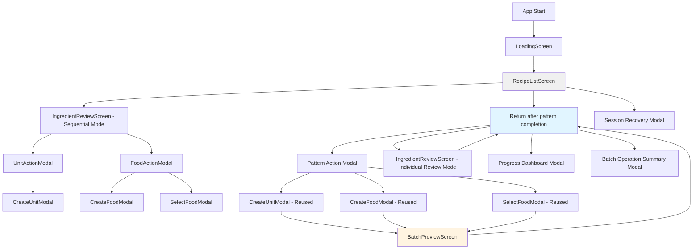

# Information Architecture (IA)

## Site Map / Screen Inventory

**Screen Hierarchy:**
- **LoadingScreen** (Entry point) - Fetches data, analyzes patterns, checks for saved sessions
- **RecipeListScreen** (Main hub) - Lists unparsed recipes with stats; gateway to both modes
- **PatternGroupScreen** (NEW - Batch mode) - Groups ingredients by pattern with batch actions
- **BatchPreviewScreen** (NEW - Confirmation) - Shows all affected ingredients before batch commit
- **IngredientReviewScreen** (Existing - Sequential) - One-ingredient-at-a-time processing
- **Modals** - Reused across both modes for consistency (CreateUnitModal, CreateFoodModal, SelectFoodModal)

## Navigation Structure

**Primary Navigation:** Keyboard-driven screen transitions with clear mode indicators in status bar

- From **RecipeListScreen**:
  - `Enter` on recipe → **IngredientReviewScreen** (sequential mode for that recipe)
  - `b` → **PatternGroupScreen** (batch mode across all recipes)
  - `q` → Exit application

- From **PatternGroupScreen**:
  - `Enter` on pattern → **Pattern Action Modal** → (create/alias) → **BatchPreviewScreen**
  - `i` on pattern → **IngredientReviewScreen** (individual review for that pattern's instances)
  - `s` on pattern → Skip pattern (stays on PatternGroupScreen)
  - `d` → **Progress Dashboard Modal**
  - `q` → **RecipeListScreen**

- From **BatchPreviewScreen**:
  - `Enter` or `c` → Confirm and execute batch operation → **PatternGroupScreen**
  - `Esc` or `x` → Cancel and return → **PatternGroupScreen**

**Secondary Navigation:** Context-sensitive help footer on every screen showing available shortcuts

**Breadcrumb Strategy:** Status bar shows current mode and screen path:
- `Recipe List` (neutral)
- `Recipe List > Batch Mode` (when in PatternGroupScreen)
- `Recipe List > Batch Mode > Preview` (when confirming batch operation)
- `Recipe List > Sequential: [Recipe Name]` (when processing individual recipe)

---
