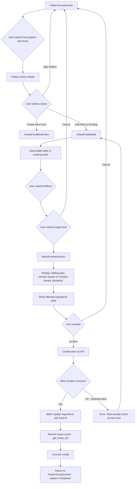
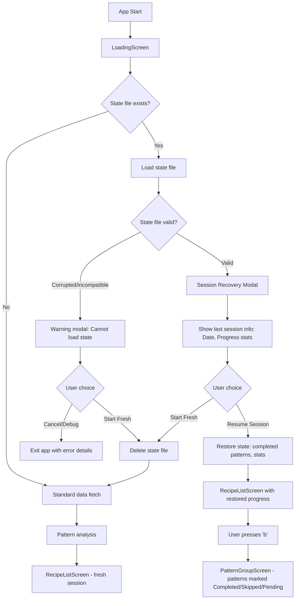
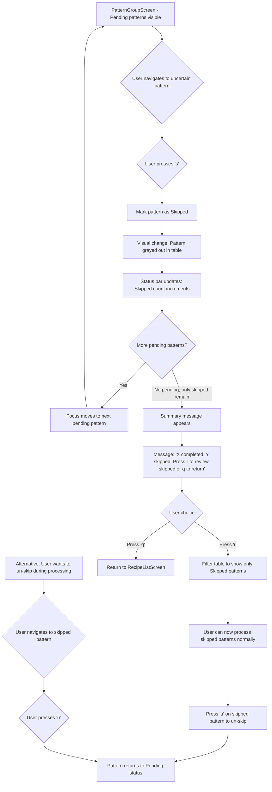

# User Flows

## Flow 1: Batch Unit Creation

**User Goal:** Create a unit once (e.g., "tsp") and apply it to all matching unparsed ingredients across multiple recipes

**Entry Points:**
- RecipeListScreen → Press `b` → PatternGroupScreen with unit patterns displayed
- Resume session → Directly to PatternGroupScreen if saved state exists

**Success Criteria:**
- Unit created in Mealie database
- All ingredients with matching pattern updated with new unit ID
- Pattern marked as "Completed" in PatternGroupScreen
- Success message shows count of affected ingredients

### Flow Diagram

```mermaid
graph TD
    A[PatternGroupScreen] --> B{User selects unit pattern with Enter}
    B --> C[Pattern Action Modal appears]
    C --> D{User selects action}
    D -->|Create New Unit| E[CreateUnitModal]
    D -->|Skip Pattern| A
    E --> F{User fills form: abbreviation, name, description}
    F -->|Submit| G[Validate unit data]
    G -->|Invalid| H[Show error message]
    H --> E
    G -->|Valid| I[BatchPreviewScreen]
    I --> J[Display table: Recipe | Ingredient Text | Status]
    J --> K{User reviews and chooses}
    K -->|Confirm - Enter/c| L[Create unit via API]
    L --> M[Progress indicator: Updating ingredients...]
    M --> N[Batch update all ingredients with unit ID]
    N --> O{Any failures?}
    O -->|No failures| P[Success modal: X ingredients updated]
    O -->|Some failures| Q[Partial success modal: X/Y updated, Z failed]
    Q --> R[Show failure details + Retry option]
    P --> S[Return to PatternGroupScreen - pattern marked Completed]
    S --> A
    K -->|Cancel - Esc/x| A
    F -->|Cancel| A
```

### Edge Cases & Error Handling

- **Duplicate unit abbreviation:** Pre-flight validation catches before API call; modal shows error "Unit 'tsp' already exists"
- **API timeout during creation:** Retry with exponential backoff (3 attempts); if all fail, show error and don't proceed to batch update
- **Partial batch update failures:** Continue processing remaining ingredients; show summary with failed items and "Retry Failed" button
- **Network disconnect mid-batch:** Collect all failures, display error modal with list of affected recipe names, mark pattern as "Pending" (not completed)
- **Empty pattern list:** Shouldn't occur (pattern analysis filters these), but if encountered, show warning "No ingredients found for pattern" and skip

**Notes:** CreateUnitModal is reused from existing sequential workflow. BatchPreviewScreen must clearly indicate this is a CREATE operation (not alias). Progress indicator during batch update is critical - users need to know system is working (could take 10-30 seconds for 50+ ingredients).

---

## Flow 2: Batch Food Alias Creation

**User Goal:** Add an alias to an existing food (e.g., alias "chicken breast" → existing food "Chicken Breast, Boneless") and apply to all matching ingredients

**Entry Points:**
- RecipeListScreen → Press `b` → PatternGroupScreen with food patterns displayed
- PatternGroupScreen after skipping unit patterns

**Success Criteria:**
- Alias created for existing food in Mealie database
- All ingredients with matching pattern updated with food ID
- Pattern marked as "Completed"
- Foods cache refreshed before processing next pattern

### Flow Diagram



### Edge Cases & Error Handling

- **Alias already exists for selected food:** API returns 409 conflict; show error modal "Alias 'chicken breast' already exists for 'Chicken Breast, Boneless'" and return to SelectFoodModal
- **Food deleted between cache load and alias creation:** API returns 404; show error "Selected food no longer exists" and refresh foods cache, return to SelectFoodModal
- **Search returns no results in SelectFoodModal:** Show "No foods found matching '[query]'" message; offer "Create New Food Instead" option
- **User selects wrong food accidentally:** BatchPreviewScreen shows food name clearly in header; user can cancel and re-select
- **Cache refresh fails after alias creation:** Log warning but continue; alias was created successfully, next pattern will trigger cache refresh attempt

**Notes:** SelectFoodModal must support fuzzy search (users typing "chicken" should see "Chicken Breast, Boneless", "Chicken Thigh", etc.). BatchPreviewScreen header MUST clearly show the target food name to prevent mistakes. Cache refresh after alias creation is critical - if skipped, the new alias won't be available for similarity detection on subsequent patterns.

---

## Flow 3: Session Recovery After Interruption

**User Goal:** Resume batch processing work after closing the application, without losing progress or repeating completed patterns

**Entry Points:**
- App startup → LoadingScreen detects `.mealie_parser_state.json` file

**Success Criteria:**
- User presented with clear choice: resume or start fresh
- If resume selected, PatternGroupScreen shows accurate completed/skipped/pending status
- Completed patterns do not reappear
- Progress statistics (units/foods created, ingredients processed) reflect previous session

### Flow Diagram



### Edge Cases & Error Handling

- **State file from older app version (schema mismatch):** Detect version incompatibility; show error "State file from incompatible version, starting fresh" and delete file
- **State file references deleted recipes:** During load, validate recipe IDs still exist; silently remove non-existent recipes from state, continue with valid data
- **Corrupted JSON in state file:** Catch parse exception; show user-friendly error "Cannot read saved session (file corrupted)" with Start Fresh option
- **State file timestamp very old (30+ days):** Show warning in recovery modal "This session is from [date] - Mealie data may have changed. Recommend starting fresh." but still allow resume
- **User creates unit/food outside app, then resumes:** Pattern might be resolved now; re-run pattern analysis on resume to detect this, skip patterns that are now fully parsed

**Notes:** Recovery modal should show meaningful stats (e.g., "Last session: Oct 5, 2025 - 47 patterns completed, 120 ingredients processed") to help user decide. If state restoration encounters any errors during the process, should fall back to fresh session rather than leaving app in inconsistent state.

---

## Flow 4: Pattern Skip and Defer

**User Goal:** Skip uncertain patterns without making a decision, focus on high-confidence patterns first, review skipped patterns later

**Entry Points:**
- PatternGroupScreen with pending patterns

**Success Criteria:**
- Pattern marked as "Skipped" and visually distinguished (grayed out)
- Skipped pattern remains in list for later review
- User can un-skip patterns
- After all pending patterns processed, user prompted to review skipped patterns

### Flow Diagram



### Edge Cases & Error Handling

- **User skips all patterns without processing any:** Show message "All patterns skipped. Press 'r' to review or 'q' to exit batch mode." No success stats displayed.
- **User accidentally skips pattern:** Press 'u' to immediately undo; pattern returns to Pending state and becomes selectable
- **Skipped pattern resolved externally (unit/food created outside app):** On next load or pattern refresh, pattern disappears from list entirely (no longer unparsed)
- **User processes skipped pattern later, creates unit/food:** Skipped status changes to Completed normally; no special handling needed
- **User quits app with skipped patterns, resumes session:** State file preserves skipped status; patterns appear as Skipped on resume

**Notes:** Skipped patterns should remain visible in table (not hidden) to remind user they exist. Visual distinction must be clear but not too subtle - consider strikethrough text + dimmed color + "SKIPPED" label in status column. The 'r' key to review skipped is only available after all pending patterns are done, to encourage users to handle high-confidence items first.

---
